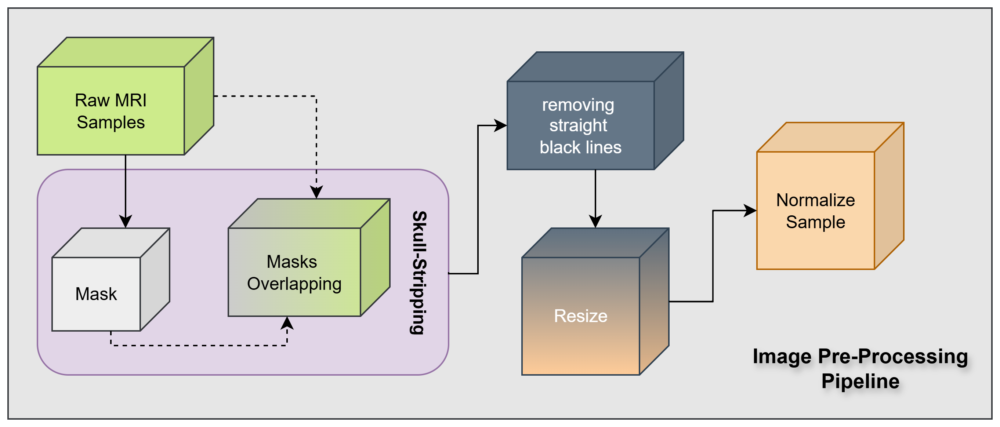

# A Novel Alzheimer’s Disease Classification Framework Integrating 3D CNN with Bidirectional Feature Pyramid Network and Vision Transformers

## Abstract
Alzheimer’s disease (AD) is a progressive neurodegenerative disorder that severely affects memory and cognitive function, underscoring the need for accurate and early diagnostic tools. Deep learning has shown strong potential in automated AD detection from brain MRI scans; however, many existing approaches either overlook the full volumetric context of MRI data or rely on limited feature fusion strategies that weaken spatial coherence. To address these challenges, this study proposes **BiFPN3DViT**, a hybrid deep learning framework that integrates a hierarchical 3D convolutional backbone as the foundational component of a Bidirectional Feature Pyramid Network (BiFPN), coupled with a Vision Transformer (ViT) for global contextual learning. The unified 3D CNN–BiFPN module jointly extracts and fuses multi-scale volumetric features through both bottom-up and top-down pathways, forming a rich spatial representation that is subsequently refined by the transformer encoder. Evaluated on 4,706 MRI scans from the Alzheimer’s Disease Neuroimaging Initiative (ADNI) dataset, the proposed model achieved over 92% classification accuracy across AD, mild cognitive impairment (MCI), and cognitively normal (CN) subjects. Comparative and ablation studies confirm the complementary strengths of convolutional and transformer-based modeling, while attention visualization highlights clinically relevant brain regions. These results demonstrate that **BiFPN3DViT** offers a scalable, interpretable, and computationally efficient framework for MRI-based Alzheimer’s disease diagnosis, advancing the integration of multi-scale feature learning and attention-driven analysis in neuroimaging.

---

## Preprocessing Pipeline
**Figure 1:** Overview of the preprocessing pipeline used for preparing MRI scans prior to model training.




## Important Preprocessing

### HD-BET
This approach is utilized for skull stripping from the MRI images. Preprocess the data using the [HD-BET](https://github.com/MIC-DKFZ/HD-BET) method and prepare the data as instructed below.

**Figure 2:** Example MRI scan before applying preprocessing steps.  


**Figure 3:** Example MRI scans after applying preprocessing and skull stripping.  


---

## Dataset Preparation
Your dataset should be structured in a DataFrame as follows:

```
_____________________
| ADNI_path | Group |
|-----------|-------|
|    abc.nii| MCI   |
|    123.nii| NC    |
|  ab123.nii| AD    |
---------------------

```

---

## Model Architecture

**Figure 4:** Complete architecture of the proposed BiFPN3DViT model, integrating a 3D CNN backbone with BiFPN and Vision Transformer modules.  


**Figure 5:** Detailed structure of the Bidirectional Feature Pyramid Network (BiFPN) used for efficient multi-scale feature fusion.  


**Figure 6:** Transformer encoder block for capturing long-range dependencies and global contextual representations.  


---


## Create Environment to Run Code
- Python 3.10.15
```sh
conda create BiFPN3DViT python=3.10.15
conda activate BiFPN3DViT

```

## Installation
1. Clone the repository:
    ```sh
    git clone https://github.com/...
    ```
2. Navigate to the project directory:
    ```sh
    cd ./BiFPN3DViT
    ```
3. Install the required packages:
    ```sh
    pip install -r requirements.txt
    ```

## Usage

### Training
To train the model, run the following command:
```sh
python train.py
```

### Evaluation
To evaluate the model, run the following command:
```sh
python test.py
```

### GradCAM Results
**Figure 7:** GradCAM visualizations highlighting important brain regions contributing to the model’s Alzheimer’s classification decision.
<p align="center">
    
    
</p>


## Citation

If you use this work in your research, please cite it as follows:

```bibtex
@article{BiFPN3DViT_2025,
  title     = {A Novel Alzheimer’s Disease Classification Framework Integrating 3D CNN with Bidirectional Feature Pyramid Network and Vision Transformers},
  author    = {Alsubaie, M; },
  year      = {2025},
  journal   = {Sbmitted Journa},
  volume    = {XX},
  number    = {YY},
  pages     = {1--15},
  doi       = {10.XXXX/XXXXXX},
  url       = {https://github.com/MAlsubaie/BiFPN3DViT},
}

```

## License
This project is licensed under the MIT License - see the [LICENSE](LICENSE) file for details.

